# Vulnhuntr Code Analysis Flow Diagram

## Overview
Vulnhuntr uses a multi-stage analysis approach with iterative context gathering to identify vulnerabilities in Python codebases.

```mermaid
flowchart TD
    Start([Start]) --> ParseArgs[Parse CLI Arguments]
    ParseArgs --> InitRepo[Initialize RepoOps]
    
    %% Repository Preparation Phase
    InitRepo --> GetFiles[Get Relevant Python Files]
    GetFiles --> CheckAnalyzeFlag{User specified<br/>--analyze flag?}
    
    CheckAnalyzeFlag -->|Yes| AnalyzeSpecific[Analyze specific file/directory]
    CheckAnalyzeFlag -->|No| FilterNetwork[Filter for network-related files<br/>using regex patterns]
    
    AnalyzeSpecific --> FilesToAnalyze[Files to Analyze List]
    FilterNetwork --> FilesToAnalyze
    
    %% README Analysis Phase
    FilesToAnalyze --> ReadREADME[Read README.md content]
    ReadREADME --> InitLLM1[Initialize LLM<br/>Claude/GPT/Ollama]
    InitLLM1 --> SummarizeREADME[LLM: Summarize README<br/>for project context]
    
    %% System Prompt Setup
    SummarizeREADME --> CreateSysPrompt[Create System Prompt with:<br/>- Instructions<br/>- README Summary]
    CreateSysPrompt --> InitLLM2[Re-initialize LLM with<br/>System Prompt]
    
    %% Main Analysis Loop
    InitLLM2 --> ForEachFile[For Each File]
    ForEachFile --> InitialAnalysis[Initial Analysis]
    
    %% Initial Analysis
    InitialAnalysis --> PreparePrompt1[Prepare Initial Prompt:<br/>- File Code<br/>- Analysis Instructions<br/>- Guidelines<br/>- Response Format]
    PreparePrompt1 --> LLMCall1[LLM Call: Initial Analysis]
    LLMCall1 --> ParseResponse1[Parse Response:<br/>- Scratchpad<br/>- Analysis<br/>- PoC<br/>- Confidence Score<br/>- Vulnerability Types<br/>- Context Code Requests]
    
    ParseResponse1 --> CheckVulns{Confidence > 0 AND<br/>Vulnerabilities Found?}
    CheckVulns -->|No| NextFile[Next File]
    CheckVulns -->|Yes| SecondaryAnalysis[Secondary Analysis]
    
    %% Secondary Analysis Loop
    SecondaryAnalysis --> ForEachVuln[For Each Vulnerability Type]
    ForEachVuln --> InitIteration[Initialize:<br/>- stored_code_definitions = &#123;&#125;<br/>- iteration = 0]
    
    InitIteration --> IterationLoop{Iteration < 7?}
    IterationLoop -->|No| NextVuln[Next Vulnerability]
    IterationLoop -->|Yes| CheckIteration{Iteration > 0?}
    
    %% Context Gathering
    CheckIteration -->|Yes| GatherContext[For Each Context Request:<br/>1. Extract symbol using SymbolExtractor<br/>2. Find definition in codebase<br/>3. Store in definitions dict]
    CheckIteration -->|No| SkipContext[Skip Context Gathering<br/>- First iteration]
    
    GatherContext --> PreparePrompt2[Prepare Vuln-Specific Prompt:<br/>- File Code<br/>- Context Definitions<br/>- Example Bypasses<br/>- Vuln-Specific Instructions<br/>- Previous Analysis]
    SkipContext --> PreparePrompt2
    
    PreparePrompt2 --> LLMCall2[LLM Call: Vuln-Specific Analysis]
    LLMCall2 --> ParseResponse2[Parse Response]
    
    ParseResponse2 --> CheckNewContext{New Context<br/>Requested?}
    CheckNewContext -->|No| CheckSameContext{Same Context<br/>Requested Twice?}
    CheckNewContext -->|Yes| IncrementIter[Increment Iteration]
    
    CheckSameContext -->|Yes| NextVuln
    CheckSameContext -->|No| IncrementIter
    
    IncrementIter --> IterationLoop
    
    NextVuln --> MoreVulns{More Vulnerability<br/>Types?}
    MoreVulns -->|Yes| ForEachVuln
    MoreVulns -->|No| NextFile
    
    NextFile --> MoreFiles{More Files?}
    MoreFiles -->|Yes| ForEachFile
    MoreFiles -->|No| End([End])
```



## Key Components

### 1. **RepoOps Class**
- Filters out test files, documentation, and build artifacts
- Identifies network-related files using regex patterns for web frameworks:
  - Flask, Django, FastAPI, Tornado, Bottle, etc.
  - Async request handlers
  - Server startup patterns

### 2. **LLM Integration**
- **Supported LLMs**: Claude (default), GPT-4, OpenRouter, Ollama
- **System Prompt**: Includes project context from README summary
- **Structured Output**: Uses Pydantic models for reliable JSON responses
- **Error Handling**: Retries, rate limiting, validation errors

### 3. **Analysis Phases**

#### Phase 1: Initial Analysis
- Analyzes entire file for potential vulnerabilities
- No context provided initially
- Returns:
  - Vulnerability types found
  - Confidence score (0-10)
  - Initial context code requests

#### Phase 2: Secondary Analysis (Iterative)
- Vulnerability-specific deep dive
- Up to 7 iterations per vulnerability type
- Each iteration:
  1. Gathers requested context code
  2. Provides accumulated context to LLM
  3. Gets refined analysis with new context requests
  4. Stops when no new context needed or max iterations

### 4. **Context Extraction (SymbolExtractor)**
- Uses Jedi parser to extract Python symbols
- Finds function/class definitions across the codebase
- Resolves imports and references
- Returns full source code for requested symbols

### 5. **Vulnerability Detection**
- **Supported Types**: LFI, RCE, SSRF, AFO, SQLI, XSS, IDOR
- **Bypass Examples**: Provides known bypass techniques for each type
- **Confidence Scoring**: 0-10 scale based on code path completeness

## LLM Prompt Structure

### Initial Analysis Prompt:
```xml
<file_code>
  <file_path>/path/to/file.py</file_path>
  <file_source>... Python code ...</file_source>
</file_code>
<instructions>Initial analysis instructions...</instructions>
<analysis_approach>Step-by-step approach...</analysis_approach>
<previous_analysis></previous_analysis>
<guidelines>Security guidelines...</guidelines>
<response_format>JSON schema for Response model</response_format>
```

### Secondary Analysis Prompt:
```xml
<file_code>...</file_code>
<context_code>
  <code>
    <name>function_name</name>
    <context_name_requested>search_term</context_name_requested>
    <file_path>/path/to/definition.py</file_path>
    <source>... function source ...</source>
  </code>
  <!-- More context definitions -->
</context_code>
<example_bypasses>Vulnerability-specific bypasses...</example_bypasses>
<instructions>Vulnerability-specific instructions...</instructions>
<analysis_approach>...</analysis_approach>
<previous_analysis>Previous iteration's analysis</previous_analysis>
<guidelines>...</guidelines>
<response_format>...</response_format>
```

## Output Format
- Structured JSON responses validated by Pydantic
- Includes scratchpad (thinking process), analysis, PoC, confidence score
- Logged to `vulnhuntr.log` for debugging
- Pretty-printed to console for user visibility